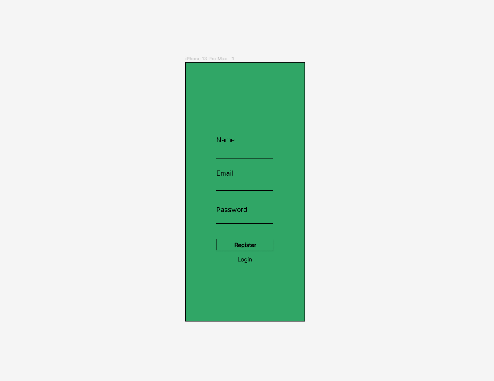
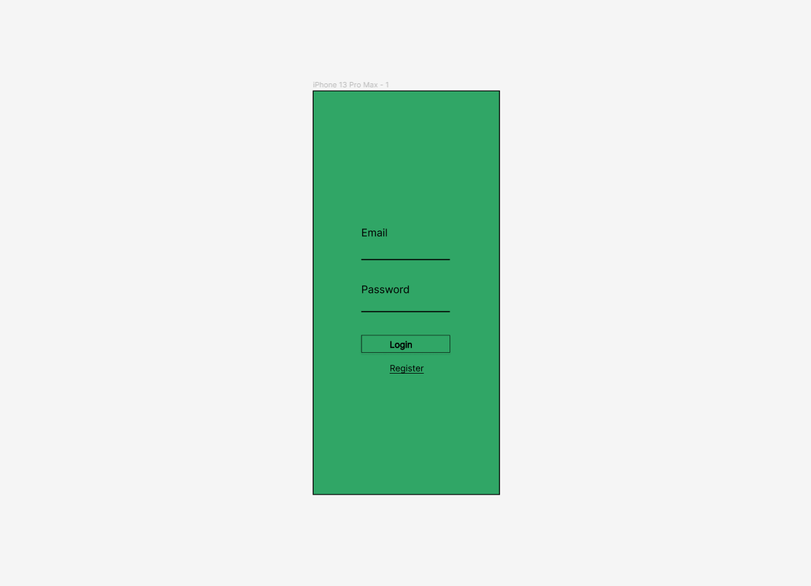
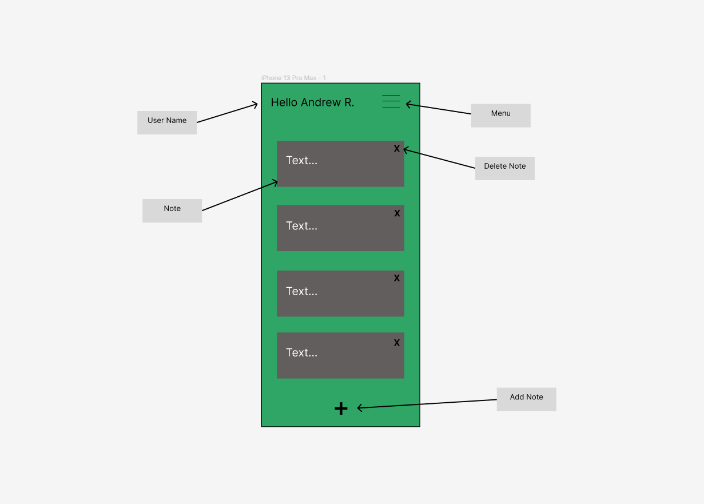
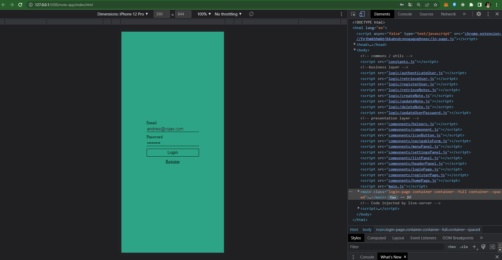
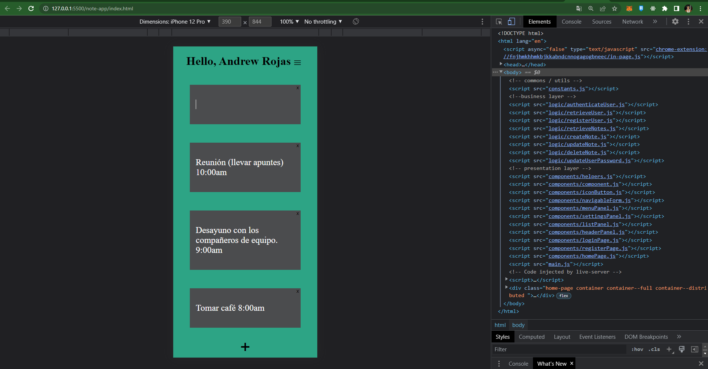

# Name aplication:
  NoteApp

## Description App

This project aims to develop an application and experiment a little with the technologies that are commonly used to develop an App.

 -- Español --

  Este proyecto tiene como objetivo desarrollar una web y experimentar un poco con las tegnologias que comunmente se utilizan para desarrolar.

## Functional Description

-Use Cases
  - Register User
  - Login
  - Create Note
  - Settings
  - Logout

## UI design 

## Data Model

User
- User id
- Name
- Email
- Password

Create Note
- User id
- Note

## Technical Description

- Blocks
- Sequence
- Components

## Technologies

- Html
- Css 
- JavaScript

## Roadmap 0 

- DONE figma 
- DONE data model
- DONE implement users logic
- DONE implement users api routes

## NoteApp Version 1.0.0

